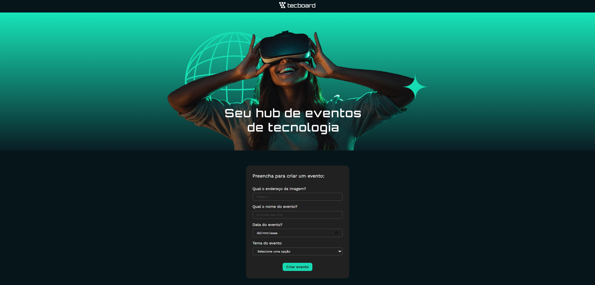
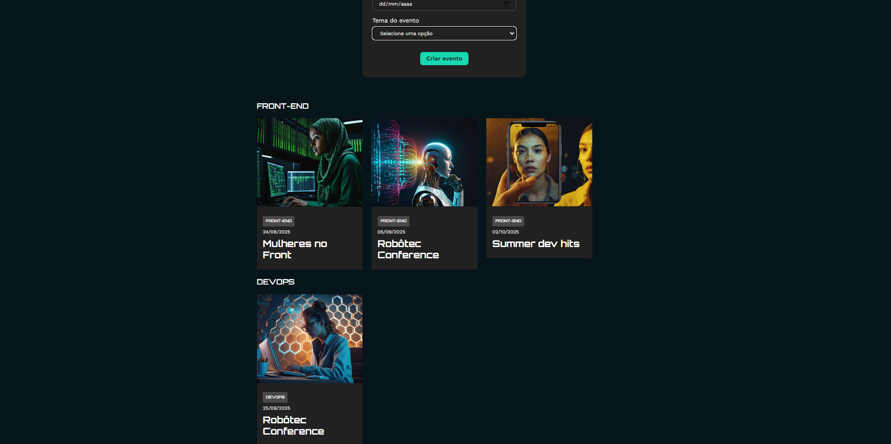

# Tecboard

> Aplicação React com JSON Server para simular uma API RESTful.

## 🔖 Sumário
- [Tecboard](#tecboard)
  - [🔖 Sumário](#-sumário)
  - [📝 Sobre](#-sobre)
  - [⚡ Funcionalidades](#-funcionalidades)
  - [🛠️ Tecnologias](#️-tecnologias)
  - [🚀 Instalação](#-instalação)
  - [🎯 Uso](#-uso)
  - [📸 Exemplos](#-exemplos)
  - [🗂️ Estrutura do Projeto](#️-estrutura-do-projeto)
  - [📞 Contato](#-contato)

## 📝 Sobre
  
> Este projeto é uma aplicação web cadastro de eventos relacionados a tecnologia.

## ⚡ Funcionalidades

- ✅ Cadastro de novos eventos
- ✅ Listar registros do JSON Server

## 🛠️ Tecnologias
- **Frontend**: ReactJS, JSX, Hooks
- **Mock API**: JSON Server,
- **Estilização:** CSS
- **Ferramentas:** VS Code, Node.js, Vite

## 🚀 Instalação
Passo a passo para rodar o projeto localmente:
```bash
# Clonar o repositório
git clone https://github.com/dayanegcneves/alura-cursos.git

# Entrar na pasta do projeto
cd alura-cursos

# Instalar dependências
npm install

# Rodar o projeto
npm start

```

## 🎯 Uso

1. **Rodar o front-end:**
   Na raiz do projeto, execute:

   ```
   npm run dev
   ```
    Isso iniciará a aplicação React.


2. **Rodar o JSON Server (back-end fake):**
    
    Entre na pasta do back-end:
    ```
    cd backend
    ```
    Em seguida, execute:
    ```
    npm run start
    ```
    Isso iniciará o JSON Server e simulará o banco de dados.

3. **Acessar a aplicação:**
    - Front-end: http://localhost:5173 (ou a porta que o Vite usar)
    - API JSON Server: http://localhost:3000 (ou a porta configurada)

## 📸 Exemplos
- Formulário de cadastro de eventos
    
- Eventos cadastrados
  

## 🗂️ Estrutura do Projeto

Explique a organização do código:

```
src/
├─ components/       # Componentes reutilizáveis
├─ assets/           # Ícone react
└─ api/              # Chamadas API
```


## 📞 Contato

LinkedIn: [https://www.linkedin.com/in/dayanegcneves/](https://www.linkedin.com/in/dayanegcneves/)

GitHub: [https://github.com/dayanegcneves](https://github.com/dayanegcneves)
